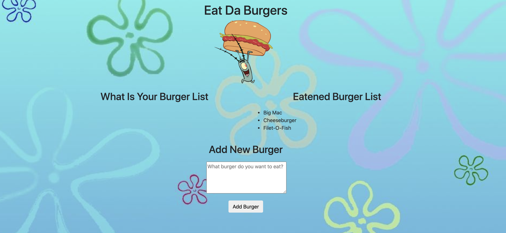

# eat-da-burger
About the project:

A burger logger application to type in bruger user wants to eat and click button to devour the burger after burger has been eaten.

Screenshot of the Application:

Description of the project:

-MySQL Workbench

-Javascript

-Node
    
    -express
    -handlebars
    -mysql
    -body-parser

-ORM

-MVC

Deployed link on Heroku: 

https://eat-da-burger-juleeb.herokuapp.com/

